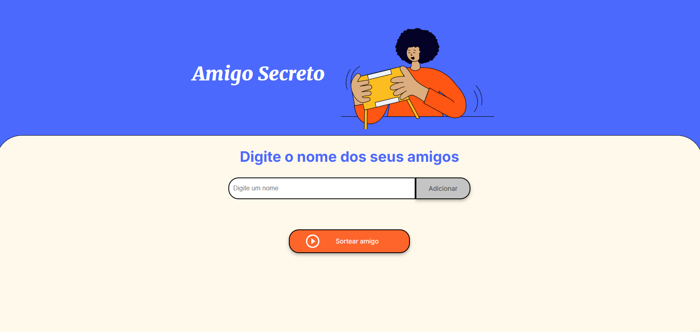

# Amigo Secreto

Este é um projeto de "Amigo Secreto" desenvolvido como parte do desafio Alura/Oracle ONE. O objetivo principal deste projeto é fortalecer habilidades em lógica de programação. O front-end foi desenvolvido pela equipe da Alura.

## Funcionalidades

- Adicionar nomes de amigos
- Listar amigos adicionados
- Sortear um amigo secreto aleatoriamente

## Capturas de Tela

### Tela Inicial


### Adicionando Amigos


### Sorteio de Amigo Secreto


## Instalação

1. Clone o repositório:
    ```sh
    git clone https://github.com/bruwno/ChallengeAmigoScreto.git
    ```
2. Navegue até o diretório do projeto:
    ```sh
    cd ChallengeAmigoScreto
    ```

## Dependências

Este projeto não possui dependências externas além de um navegador web.

## Como Executar

1. Abra o arquivo [index.html](http://_vscodecontentref_/0) em seu navegador preferido.
2. Adicione os nomes dos amigos no campo de entrada e clique em "Adicionar".
3. Após adicionar todos os amigos, clique no botão "Sortear amigo" para realizar o sorteio.

## Possíveis Problemas e Soluções

### Problema: O sorteio não funciona corretamente
- Certifique-se de que você adicionou pelo menos um amigo antes de realizar o sorteio.

### Problema: O nome do amigo não é adicionado à lista
- Verifique se o campo de entrada não está vazio antes de clicar em "Adicionar".

## Contribuição

Sinta-se à vontade para contribuir com este projeto. Para isso, siga os passos abaixo:

1. Faça um fork do projeto
2. Crie uma branch para sua feature (`git checkout -b feature/nova-feature`)
3. Commit suas alterações (`git commit -m 'Adiciona nova feature'`)
4. Faça o push para a branch (`git push origin feature/nova-feature`)
5. Abra um Pull Request

